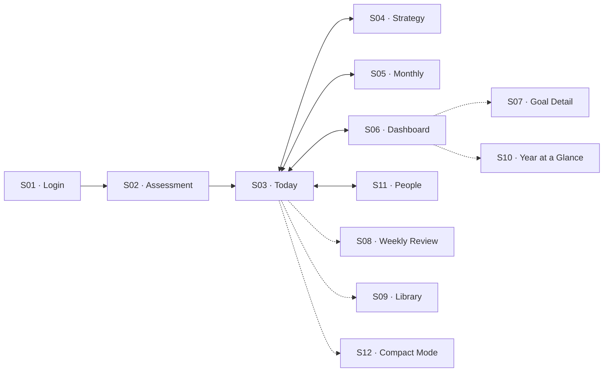
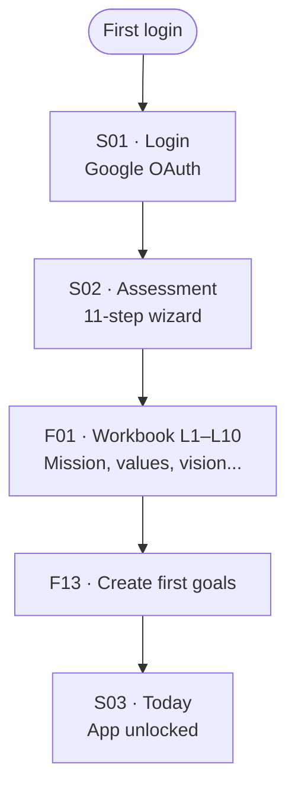
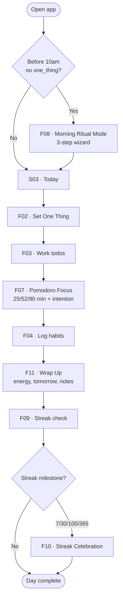
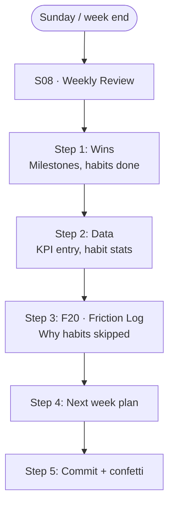
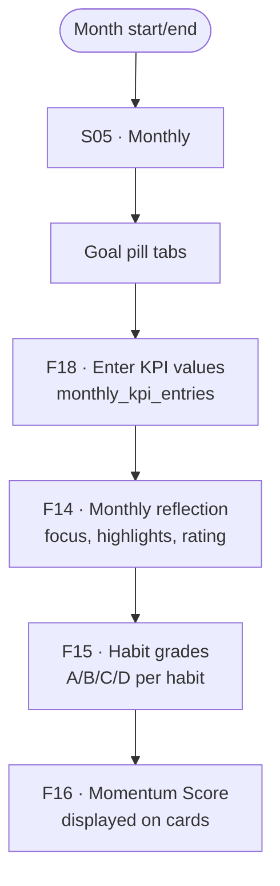
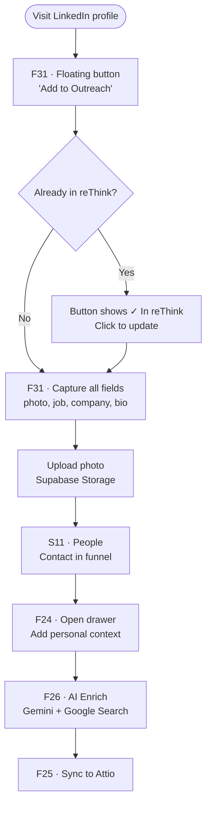
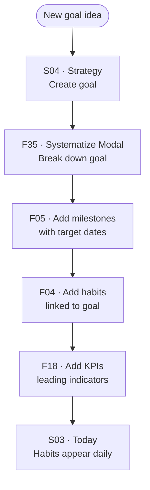
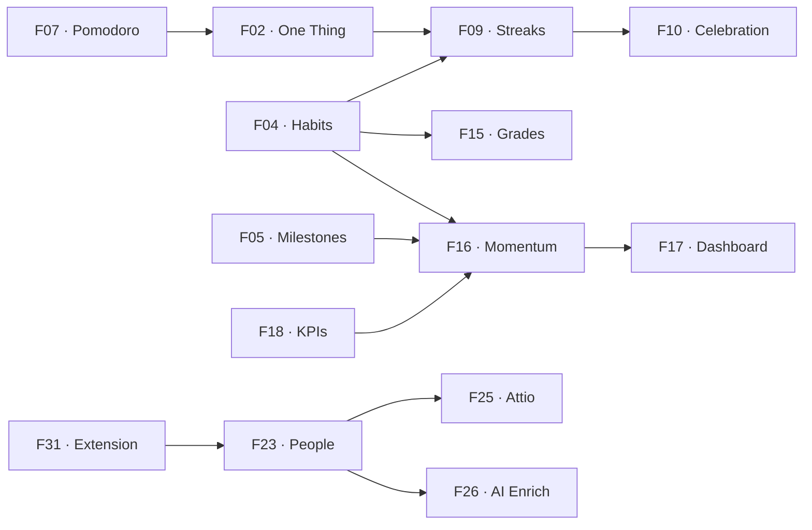

# reThink 2026
> A personal operating system for annual strategic planning and daily execution — built for founders and high-performers who want to close the gap between long-term goals and daily actions.
Last updated: 2026-03-23

---

## Objective

reThink helps a single user run their year like a CEO runs a company: starting from a 10-year vision, breaking it down to a 1-year plan, and executing daily through habits, todos, and focus sessions. It combines the Farnam Street strategic framework with a lightweight CRM, Pomodoro timer, AI coaching, and a Chrome extension that captures LinkedIn contacts — all in a macOS desktop app.

---

## Navigation Map

---

## User Flows

### FL01 · Annual Planning (First-time setup)
New user completes the Farnam Street workbook and creates their first goals to unlock the app.
Screens: S01 → S02 → S03
Features used: F01, F13

### FL02 · Daily Execution
User starts their day, sets One Thing, works through todos and habits, runs focus sessions, wraps up.
Screens: S03
Features used: F02, F03, F04, F05, F06, F07, F08, F09, F10, F11

### FL03 · Weekly Review
User reviews the past week's data, enters friction logs, and plans next week.
Screens: S08
Features used: F19, F20, F04, F18, F15

### FL04 · Monthly Planning
User reviews previous month performance and plans the next month per goal.
Screens: S05
Features used: F14, F15, F18, F16

### FL05 · Add Contact via Chrome Extension
User visits a LinkedIn profile, saves it to reThink with one click, then enriches it.
Screens: S11
Features used: F31, F23, F24, F26, F25

### FL06 · Goal → Milestone → Habit Systematization
User converts a new goal idea into a structured execution system.
Screens: S04, S03
Features used: F12, F13, F05, F04, F18

---

## Feature Connections

---

## Screens & Features

### S01 · Login — /login
Authentication entry point. Only visible to unauthenticated users.
Used in flows: FL01

#### F01 · Google OAuth Sign-in
- **What it does:** Authenticates the user via Google through Supabase Auth. On success, redirects to Assessment (first time) or Today (returning user).
- **Screens:** S01
- **Used in flows:** FL01
- **Connected features:** F13 (workbook creation on first login)
- **Backend:** T01 · profiles
- **Business rules:**
  - Only Google OAuth — no email/password option
  - On first login, a workbook for the current year is auto-created and the user is redirected to the Assessment

---

### S02 · Assessment — /assessment/*
First-time annual planning wizard based on the Farnam Street framework. Locked behind first login only; returning users skip directly to Today.
Used in flows: FL01

#### F01 · Annual Planning Wizard
- **What it does:** Guides the user through 11 steps (L1–L10 + commit): Mission, Core Values, Audience, Critical Three, Brand Promise, 10-Year Vision, 3-Year Picture, 1-Year Plan, Key Resources, Risks, and a final commitment step. Each answer is saved as a WorkbookEntry. On completion, the user creates their first active goal, which unlocks the main app.
- **Screens:** S02
- **Used in flows:** FL01
- **Connected features:** F13 (goal creation), F12 (same workbook entries appear in Strategy)
- **Backend:** T02 · workbooks, T03 · workbook_entries, T04 · goals
- **Business rules:**
  - Cannot access S03–S11 without completing this step and having at least one active goal
  - Workbook entries can be edited later from S04 · Strategy

---

### S03 · Today — /today
The main daily execution hub. 70% left panel for content, 30% collapsible right sidebar. The user spends most of their time here.
Used in flows: FL02

#### F02 · One Thing
- **What it does:** A single editable text field at the top of the left panel. The user sets their most important focus for the day. Saved as `review.one_thing`. Shown in Year at a Glance tooltip.
- **Screens:** S03
- **Used in flows:** FL02
- **Connected features:** F07 (Pomodoro intention prefills from One Thing), F22 (appears in heatmap tooltip)
- **Backend:** T09 · reviews
- **Business rules:**
  - Only one per day (tied to `reviews.date`)
  - If missing before 10am → triggers F08 Morning Ritual Mode

#### F03 · Todos
- **What it does:** A daily list of actionable tasks. Each todo has text, effort level (LOW/MED/HIGH), optional time block (AM/PM), optional goal link, and a completion checkbox. Drag-to-reorder. Filter by effort or block.
- **Screens:** S03
- **Used in flows:** FL02
- **Connected features:** F05 (milestones can generate todos), F07 (focus sessions reference todos), F28 (⌘K can create todos)
- **Backend:** T08 · todos
- **Business rules:**
  - Todos are dated — they belong to a specific day
  - Completing a todo does not auto-archive it; it stays visible with a strikethrough

#### F04 · Habits & Daily Logs
- **What it does:** A list of the user's active habits with checkboxes (BINARY) or number inputs (QUANTIFIED). Each interaction logs a `habit_log` for the day. Shows streak count next to each habit. If monthly adherence drops below 90%, shows adherence % inline.
- **Screens:** S03 (daily), S05 (grades), S06 (heatmap), S08 (review), S10 (heatmap), S12 (compact)
- **Used in flows:** FL02, FL03
- **Connected features:** F09 (streak tracking), F15 (habit grades from adherence), F16 (habits = 40% of Momentum Score), F18 (habits can auto-feed a KPI)
- **Backend:** T06 · habits, T07 · habit_logs
- **Business rules:**
  - Habit type BINARY: value 0 or 1
  - Habit type QUANTIFIED: value is an integer count
  - Streak = consecutive days with value > 0
  - Adherence % = days done / days in period × 100

#### F05 · Milestones
- **What it does:** Shows upcoming PENDING milestones on the Today screen. Each milestone has a text description and target date. Clicking opens the milestone detail modal for editing. Completed milestones appear in the Weekly Review wins step.
- **Screens:** S03 (upcoming list), S04 (per goal), S05 (monthly), S07 (goal detail), S08 (review wins)
- **Used in flows:** FL02, FL03, FL06
- **Connected features:** F16 (milestones = 30% of Momentum Score), F22 (milestone dots on year heatmap)
- **Backend:** T05 · milestones
- **Business rules:**
  - Status is either PENDING or COMPLETE (string, uppercase)
  - Today screen shows only PENDING milestones with upcoming target dates

#### F06 · Daily Journal & Notes
- **What it does:** A markdown-enabled textarea for free-form daily notes. Includes a capture parser that detects structured entries (ideas, wins, learnings, decisions, questions) and offers to save them as Captures. URLs are rendered as chip pills with context-aware icons (GitHub, Notion, Figma, etc.).
- **Screens:** S03
- **Used in flows:** FL02
- **Connected features:** F33 (captures created from journal text), F27 (AI Coach analyzes notes)
- **Backend:** T09 · reviews (notes column), T17 · captures
- **Business rules:**
  - Autosaved on blur / debounce
  - Notes are date-specific (tied to `reviews.date`)

#### F07 · Pomodoro Focus Timer
- **What it does:** A countdown timer in the right sidebar with three durations: 25 min (standard Pomodoro), 52 min (deep work), and 90 min (flow state). Before starting, user enters an intention. After completing, a check-in modal asks how it went and saves the session.
- **Screens:** S03
- **Used in flows:** FL02
- **Connected features:** F02 (intention prefilled from One Thing), F04 (can link a habit to the session), F11 (timer lives in FOCUS sidebar section)
- **Backend:** T16 · focus_sessions
- **Business rules:**
  - Sessions saved with `started_at`, `ended_at`, `duration_minutes`, `session_type`, `intention`, `completion_status` (COMPLETE/CARRIED_OVER/INCOMPLETE)
  - Ambient sound options: brown noise, rain (HTML5 Audio, requires files in `/public/sounds/`)

#### F08 · Morning Ritual Mode
- **What it does:** An overlay wizard that appears between 5am–10am if the user hasn't set their One Thing or added any todos yet. It guides them through a 3-step morning routine (check yesterday's reflection → set today's One Thing → add first todo). Always has a Skip button.
- **Screens:** S03
- **Used in flows:** FL02
- **Connected features:** F02, F03
- **Backend:** T09 · reviews, T08 · todos
- **Business rules:**
  - Only triggers in the 5am–10am window
  - Only triggers if `review.one_thing` is null AND `todos` for today is empty
  - Skip dismisses permanently for the day

#### F09 · Habit Streaks & Adherence
- **What it does:** Tracks consecutive days of habit completion (streak) and monthly adherence percentage. Streak count shown next to each habit. Adherence % shown inline when below 90%. Used to calculate habit grades and momentum.
- **Screens:** S03 (inline), S05 (grades), S06 (streak cards), S07 (30-day dot grid)
- **Used in flows:** FL02, FL03
- **Connected features:** F04 (data source), F10 (streak celebrations), F15 (grades), F16 (momentum)
- **Backend:** T07 · habit_logs
- **Business rules:**
  - Adherence % only shown when < 90% to avoid information overload
  - Streak is broken by any day with value = 0 (or no log entry)

#### F10 · Streak Celebration
- **What it does:** A full-screen overlay with animation that fires when a habit reaches a milestone streak: 7, 30, 100, or 365 consecutive days. Shows the habit name and streak count with a Flame icon and confetti.
- **Screens:** S03
- **Used in flows:** FL02
- **Connected features:** F09 (trigger)
- **Backend:** T07 · habit_logs (read-only)
- **Business rules:**
  - Fires once per milestone per habit — not on every day of a long streak
  - Dismissed with a tap/click

#### F11 · Today Sidebar (PULSE / FOCUS / WRAP UP)
- **What it does:** The collapsible right panel with three sections: PULSE (energy slider 1–10, progress summary), FOCUS (Pomodoro timer), and WRAP UP (protocol checklist, tomorrow focus text, notes, "Complete Day" CTA).
- **Screens:** S03
- **Used in flows:** FL02
- **Connected features:** F07 (FOCUS section), F02 (energy saved with review)
- **Backend:** T09 · reviews
- **Business rules:**
  - Collapsible via ⌘B keyboard shortcut; state persists across sessions
  - "Complete Day" button saves the review record and unlocks the End of Day Drawer

---

### S04 · Strategy — /strategy
Long-term strategic planning hub. Displays the full Farnam Street workbook alongside goals, milestones, habits, and KPIs.
Used in flows: FL06

#### F12 · Strategy War Map
- **What it does:** Editable display of all 10 workbook levels (L1–L10): Mission, Core Values, Audience, Critical Three, Brand Promise, 10-Year Vision, 3-Year Picture, 1-Year Plan, Key Resources, and Risks. Each level is a free-form text field saved on blur.
- **Screens:** S04
- **Used in flows:** FL06
- **Connected features:** F01 (same data, editable version)
- **Backend:** T03 · workbook_entries
- **Business rules:**
  - Answers persist per user per year (tied to `workbook_id`)
  - Can be updated at any time (not locked after Assessment)

#### F13 · Goal Management
- **What it does:** CRUD for strategic goals. Goals have a status (NOT_STARTED / ON_TRACK / AT_RISK / BLOCKED / COMPLETE), emoji, alias (short name), color pill, and motivation text. Goals can be ACTIVE, BACKLOG, ARCHIVE, or NOT_DOING. The "Not Doing" section is separate to make deliberate trade-offs explicit.
- **Screens:** S04 (CRUD), S05 (per-goal view), S06 (goal cards), S07 (detail), S03 (linked todos/habits/milestones)
- **Used in flows:** FL06
- **Connected features:** F05, F04, F18, F35, F16
- **Backend:** T04 · goals
- **Business rules:**
  - At least one ACTIVE goal required to access the main app
  - Goals are year-scoped (tied to `workbook_id`)

#### F35 · Systematize Modal
- **What it does:** A guided modal to break down a goal into milestones, habits, and KPIs in one flow. Opens from a goal card. Creates all three record types in sequence.
- **Screens:** S04
- **Used in flows:** FL06
- **Connected features:** F05, F04, F18, F13
- **Backend:** T05 · milestones, T06 · habits, T10 · leading_indicators
- **Business rules:**
  - All three steps optional — user can skip habits or KPIs

---

### S05 · Monthly — /monthly, /monthly/:goalId
Month-by-month view of goal performance. Navigate months (← →) and goals (tab pills, ⌘[ / ⌘]).
Used in flows: FL04

#### F14 · Monthly Planning
- **What it does:** Per goal, per month: a structured planning and reflection form with fields for monthly focus, key highlights, rating (1–5 stars), and narrative reflection. Autosaves on blur. Month navigation shows historical data.
- **Screens:** S05
- **Used in flows:** FL04
- **Connected features:** F18 (KPI entries in same view), F15 (habit grades in same view), F21 (monthly reflections appear in Library)
- **Backend:** T13 · monthly_plans
- **Business rules:**
  - One record per goal × month × year
  - Historical months are read-only for reflection, not planning

#### F15 · Monthly Habit Grades
- **What it does:** A letter grade (A/B/C/D) per habit for the current month based on adherence percentage. Thresholds: A ≥ 90%, B ≥ 75%, C ≥ 50%, D < 50%. Thresholds configurable in Settings.
- **Screens:** S05
- **Used in flows:** FL04
- **Connected features:** F04, F09
- **Backend:** T07 · habit_logs (read)
- **Business rules:**
  - Grade reflects the full calendar month, not just days elapsed
  - Shown as a colored badge (green/yellow/orange/red)

#### F18 · KPI Tracking (Leading Indicators)
- **What it does:** Each goal has one or more leading indicators (KPIs) with a target value and unit. Monthly actual values are entered in the Monthly screen. The Dashboard shows sparklines. Weekly Review prompts entry. A habit can auto-feed a KPI (habit log value → indicator log).
- **Screens:** S05 (entry), S06 (sparklines), S07 (trajectory), S08 (weekly entry)
- **Used in flows:** FL03, FL04
- **Connected features:** F13 (KPIs belong to goals), F16 (KPIs = 30% of Momentum Score), F04 (habit auto-feed)
- **Backend:** T10 · leading_indicators, T11 · indicator_daily_logs, T12 · monthly_kpi_entries
- **Business rules:**
  - Field name: `target` (not `annual_target`)
  - Monthly entry field: `actual_value` (not `value`)
  - Daily logs optional; monthly entries are the primary tracking unit

---

### S06 · Dashboard — /dashboard
Performance overview across all goals with trend data, heatmaps, and momentum scores.
Used in flows: FL04

#### F16 · Momentum Score
- **What it does:** A composite score (0–100) calculated as: habits 40% + milestones 30% + KPIs 30%. Displayed on goal cards as a badge with color coding (green = high, yellow = medium, red = low). Also shown on Strategy screen.
- **Screens:** S06, S04, S07
- **Used in flows:** FL04
- **Connected features:** F04, F05, F18
- **Backend:** T07 · habit_logs, T05 · milestones, T12 · monthly_kpi_entries (all read)
- **Business rules:**
  - Formula lives in `src/lib/momentum.ts`
  - Score is recalculated client-side on each page load (not stored)

#### F17 · Dashboard Overview
- **What it does:** Full performance summary: 48-week habit heatmap (green intensity = % habits done that day), goal cards with momentum + status, habit streak leaderboard, KPI sparklines for each leading indicator, AI Coach suggestions, and link to Year at a Glance.
- **Screens:** S06
- **Used in flows:** FL04
- **Connected features:** F04, F16, F18, F09, F22, F27
- **Backend:** T07 · habit_logs, T04 · goals, T10 · leading_indicators, T12 · monthly_kpi_entries, T09 · reviews
- **Business rules:**
  - Heatmap covers last 48 weeks (not calendar year)
  - Goal cards show last 3 completed milestones

---

### S07 · Goal Detail — /dashboard/goal/:id
Deep-dive audit of a single goal's performance.
Used in flows: FL04

Features used: F16, F18, F05, F04, F09

---

### S08 · Weekly Review — /weekly-review
5-step structured weekly reflection wizard. Accessible from nav and Library screen.
Used in flows: FL03

#### F19 · Weekly Review Wizard
- **What it does:** A 5-step flow: (1) Wins — celebrate completed milestones, done todos, habit streaks; (2) Data Review — enter any missing KPI values, review habit stats; (3) Friction Log — log reasons for skipped habits; (4) Next Week — set weekly One Thing, plan priorities; (5) Commit — final confirmation with confetti animation.
- **Screens:** S08
- **Used in flows:** FL03
- **Connected features:** F20, F04, F18, F05, F03, F27
- **Backend:** T09 · reviews (weekly_one_thing, ai_coach_notes), T12 · monthly_kpi_entries, T05 · milestones
- **Business rules:**
  - Weekly review saves `weekly_one_thing` on the review record for the week
  - AI coach notes generated automatically at step 5 via F27

#### F20 · Friction Log
- **What it does:** For each habit that wasn't completed during the week, the user selects a reason: Travel, Forgot, Too tired, External blocker, or Other. Used to identify patterns over time.
- **Screens:** S08 (step 3)
- **Used in flows:** FL03
- **Connected features:** F19, F04
- **Backend:** T15 · friction_logs
- **Business rules:**
  - One log entry per habit per week
  - Reasons feed pattern analysis (not yet surfaced in UI — future feature)

---

### S09 · Reflection Library — /library
Searchable archive of all written content across the app.
Used in flows: (standalone)

#### F21 · Reflection Library
- **What it does:** A chronological, searchable list of all the user's written content: daily notes, weekly insights, monthly recaps, workbook entries, and the annual letter. Filter by type. Full-text search. Expandable previews with energy level meta-tags.
- **Screens:** S09
- **Used in flows:** (standalone)
- **Connected features:** F06 (daily notes source), F14 (monthly reflections source), F19 (weekly insights source), F12 (workbook entries source)
- **Backend:** T09 · reviews, T13 · monthly_plans, T03 · workbook_entries (all read)
- **Business rules:**
  - Read-only (no editing from Library — must go to source screen)
  - Accessible from: ⌘K → "Go to Library", WeeklyReview bottom link, or direct `/library` route

---

### S10 · Year at a Glance — /year
52-week visual overview of the full year's habits and energy.
Used in flows: (standalone)

#### F22 · Year at a Glance
- **What it does:** A 52-column × 7-row grid (one cell per day). Two optional layers: green intensity = daily habit completion rate, blue intensity = energy level (1–10). Milestone completion dates shown as small dots. Hover tooltip shows date and One Thing excerpt. Year navigation (← →).
- **Screens:** S10
- **Used in flows:** (standalone)
- **Connected features:** F04, F02, F05
- **Backend:** T07 · habit_logs, T09 · reviews, T05 · milestones (all read)
- **Business rules:**
  - Uses `reviews.date` field (not `review_date`)
  - O(1) lookups via Maps for performance (52 × 7 = 364 cells)

---

### S11 · People — /people
Relationship management system (CRM). Tracks professional contacts through a funnel.
Used in flows: FL05

#### F23 · People / Contact Funnel
- **What it does:** Displays contacts organized by relationship status in funnel columns: PROSPECT → INTRO → CONNECTED → RECONNECT → ENGAGED → NURTURING → DORMANT. Each card shows name, company, health score badge, last interaction date. Filter by status or category. Quick-add new contact.
- **Screens:** S11
- **Used in flows:** FL05
- **Connected features:** F24 (drawer), F25 (Attio sync), F31 (extension adds contacts here)
- **Backend:** T18 · outreach_logs, T19 · interactions
- **Business rules:**
  - Health score (1–10) decays based on time since last interaction (formula in `funnelDefaults.ts`)
  - Categories: business_dev, partner, client, mentor, investor, advisor, peer, other

#### F24 · Contact Detail Drawer
- **What it does:** A full slide-in panel for a contact showing all profile data, interactions timeline, notes, personal context, skills, AI enrichment status, and Attio sync controls. Photo displayed (via Supabase Storage or proxy Edge Function for LinkedIn CDN URLs).
- **Screens:** S11, S03 (accessible from Outreach Panel)
- **Used in flows:** FL05
- **Connected features:** F23, F25, F26
- **Backend:** T18 · outreach_logs, T19 · interactions
- **Business rules:**
  - "Personal Context" field is user-written context for the relationship (never overwritten by AI)
  - AI enrichment banner appears for contacts < 24h old without personal context
  - LinkedIn CDN photos routed through `proxy-image` Edge Function

#### F25 · Attio CRM Sync
- **What it does:** Two-way sync with Attio (external CRM). "Sync to Attio" button pushes contact data (name, job, company, LinkedIn URL, skills, category, notes) to Attio's People and Companies objects. Also can pull from Attio to update local record.
- **Screens:** S11 (via F24 drawer)
- **Used in flows:** FL05
- **Connected features:** F23, F24, F26
- **Backend:** T18 · outreach_logs
- **Business rules:**
  - Requires Attio API key in Settings
  - `avatar_url` is NOT synced (Attio manages it as a protected field)
  - `primary_location` is NOT synced (requires structured address object)
  - Custom Attio attributes: category (select), skills (multi-select), relationship_status (select), health_score (number), linkedin_followers (number), linkedin_contacts (number)

#### F26 · AI Contact Enrichment
- **What it does:** Uses Gemini 2.5 Flash with Google Search grounding to enrich a contact's profile. Finds company domain, improves the bio/about, identifies skills, suggests approach angles and relationship context. Results appended to notes and personal_context (with [AI] prefix).
- **Screens:** S11 (via F24 drawer)
- **Used in flows:** FL05
- **Connected features:** F24, F25
- **Backend:** T18 · outreach_logs
- **Business rules:**
  - Guards: `company_domain` only set if not already present; `about` only overwritten if null, < 100 chars, or contains LinkedIn accessibility noise
  - `ai_enriched_at` timestamp set after successful enrichment
  - Requires Gemini API key in Settings

---

### S12 · Compact Mode — /compact
Floating window overlay for quick checks. 480×340px fixed, always on top, no decorations.
Used in flows: (standalone)

#### F30 · Compact Mode
- **What it does:** A minimal floating window (Granola-style) showing: today's date, top 5 habits with checkboxes, up to 3 upcoming milestones, a link to the main Focus timer, and a recap section (habits done count, energy, One Thing if set). Designed for quick checks without switching away from other apps.
- **Screens:** S12
- **Connected features:** F04, F05, F02
- **Backend:** T06 · habits, T07 · habit_logs, T05 · milestones, T09 · reviews

---

## Cross-cutting Features

#### F27 · AI Coach
- **What it does:** Analyzes recent activity (todos, habits, notes) and surfaces coaching suggestions. Accessible from the Dashboard and generated automatically at the end of the Weekly Review (step 5). Uses Anthropic Claude via a Supabase Edge Function.
- **Screens:** S06, S08
- **Used in flows:** FL03
- **Connected features:** F06, F19
- **Backend:** R01 · Edge Function: ai-coach, T09 · reviews (ai_coach_notes)
- **Business rules:**
  - Requires Anthropic API key set as Supabase secret
  - Results saved to `reviews.ai_coach_notes`

#### F28 · Command Palette (⌘K)
- **What it does:** Global search and action palette. Finds goals, milestones, todos, captures. Provides quick actions: Go to Library, start focus timer. Keyboard navigation: ↑↓ Enter Esc.
- **Screens:** All (global)
- **Used in flows:** FL02
- **Connected features:** F13, F05, F03, F33, F21
- **Backend:** T04 · goals, T05 · milestones, T08 · todos, T17 · captures (all read)

#### F29 · Keyboard Shortcuts
- **What it does:** Global shortcuts: ⌘1 Today, ⌘2 Monthly, ⌘3 Strategy [unclear — verify], ⌘4 Dashboard, ⌘5 Weekly Review [unclear — verify], ⌘6 People, ⌘K Command Palette, ⌘B sidebar collapse (Today only), ⌘[ / ⌘] goal navigation (Monthly only).
- **Screens:** All (global)

#### F31 · Chrome Extension
- **What it does:** A Manifest V3 Chrome extension that injects a floating button on LinkedIn profile pages. Captures name, job, company, bio, connections, followers, photo, and company domain. Uploads photo to Supabase Storage. Smart upsert (never overwrites user edits). Also has a popup with category picker and a context menu for link capture.
- **Screens:** S11 (contacts appear here)
- **Used in flows:** FL05
- **Connected features:** F23, F24
- **Backend:** T18 · outreach_logs, Supabase Storage · contact-photos
- **Business rules:**
  - Detailed documentation in `chrome-extension/CHROME_EXTENSION.md`

#### F32 · Auto-Update (Tauri)
- **What it does:** The macOS app checks for updates via the GitHub Releases endpoint. When a new version is available, Settings shows an "Install vX.X.X" button. The app downloads, verifies the signature, and restarts.
- **Screens:** Settings modal (all screens)
- **Business rules:**
  - Releases triggered by pushing a `vX.X.X` git tag
  - Packages signed with Minisign private key (stored in `.tauri-private-key.txt`, gitignored)
  - First Mac launch after manual install: if "damaged" error → `xattr -cr /Applications/reThink.app`

#### F33 · Capture Modal
- **What it does:** Create structured captures: idea, learning, reflection, decision, win, or question. Each capture has a type, body, and optional links to a goal, milestone, or todo. Also auto-created by the capture parser in the Journal (F06) when structured text is detected.
- **Screens:** S03 (⌘K), all via modal
- **Used in flows:** FL02
- **Connected features:** F06, F28
- **Backend:** T17 · captures

#### F34 · Notification System
- **What it does:** Desktop notifications for: morning brief (habit reminder at configured time), habit streak at risk (missed yesterday), milestone approaching (within 7 days), weekly review reminder (Sunday). Requires macOS notification permission.
- **Screens:** All (background)
- **Connected features:** F04, F05, F19
- **Backend:** T06 · habits, T05 · milestones (read)
- **Business rules:**
  - Configured in Settings (enable/disable per notification type, timing)
  - Implemented via Tauri plugin-notification
